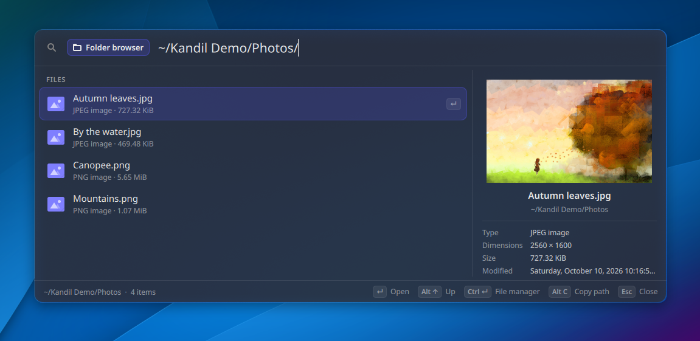
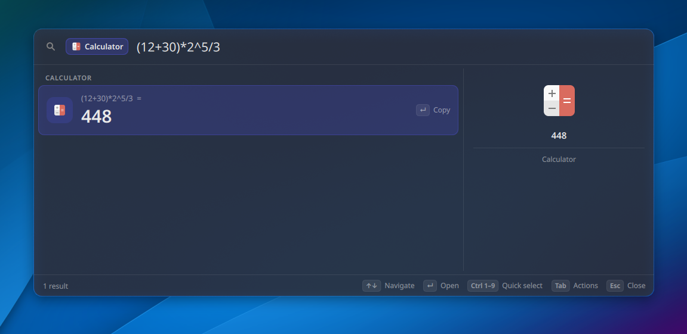
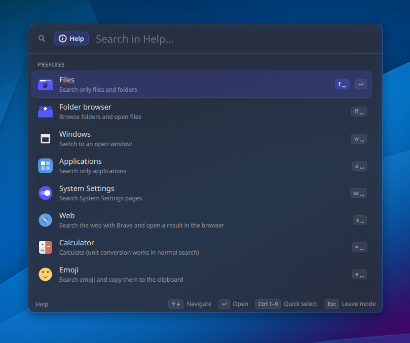
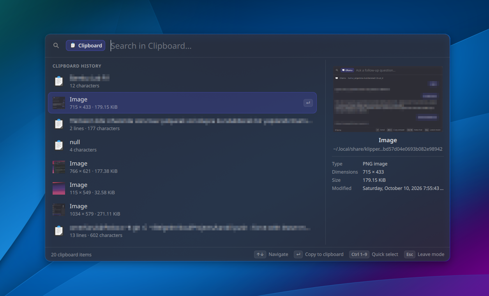
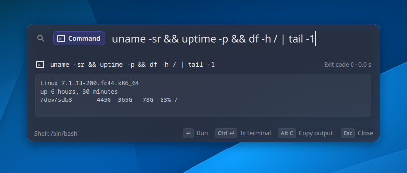
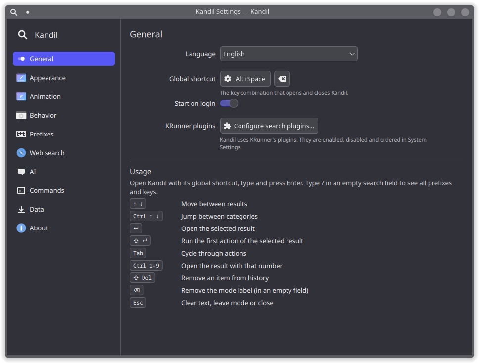

<div align="center">

# Kandil

An application launcher for KDE Plasma 6 based on KRunner

[](LICENSE)


</div>

Kandil is an application launcher for KDE Plasma 6. It uses KRunner's search
engine, so it returns the same results as KRunner and works with the same
plugins and plugin settings. Only the window is different.

KRunner's interface is compiled into the program in Plasma 6 and cannot be
changed with themes. Kandil was written to have a launcher with a different
layout and a few extra features while keeping KRunner's search.

The code was written by Claude Opus 5.5.



## Features

- Search results from all enabled KRunner plugins (applications, files,
  System Settings, windows, calculator, unit converter and others).
- With an empty search field, a list of recently and frequently opened items.
- Ctrl+1 to Ctrl+9 open the first nine results directly.
- Calculator and unit converter results are shown in a larger row; Enter copies
  the result.
- A preview panel for the selected result; for files it shows image thumbnails,
  the first lines of text files, folder contents, size and modification date.
- Prefixes that limit the search to one source, for example `f` for files.
- Clipboard history search through Klipper.
- Running a shell command and showing its output in the panel.
- A settings window and a JSON configuration file.
- Interface translations for 31 languages.

<p>
  
  
</p>

## Requirements

- KDE Plasma 6 in a Wayland session
- Qt 6.9 or newer
- systemd user session
- Python 3 with PySide6
- KDE QML modules: Milou, Kirigami, LayerShellQt, KQuickControls and
  qqc2-desktop-style

The installer checks for these and can install the missing packages on Fedora,
Arch Linux, openSUSE and Debian/Ubuntu.

## Installation

```bash
curl -fsSL https://raw.githubusercontent.com/Vialeth/kandil/main/install.sh | bash
```

Or from a clone:

```bash
git clone https://github.com/Vialeth/kandil.git
cd kandil
./install.sh
```

The installer:

1. checks for Plasma 6, Wayland and systemd,
2. lists missing packages and installs them with `sudo` after confirmation,
3. copies Kandil to `~/.local/share/kandil` (Kandil itself does not need root),
4. installs and starts a systemd user service, so Kandil starts with the session,
5. assigns Alt+Space to Kandil. If KRunner uses Alt+Space, it asks before
   moving the shortcut. KRunner stays available on Alt+F2.

Running the installer again updates an existing installation and keeps the
settings.

| Option | Description |
|---|---|
| `--yes` | Accept all defaults without asking |
| `--no-deps` | Do not install missing packages |
| `--shortcut KEYS` | Use a different shortcut, e.g. `"Meta+Space"`, or `none` |
| `--keep-krunner` | Do not change KRunner's shortcuts |

## Usage

Press Alt+Space, type a query and press Enter. Typing `?` in the empty search
field shows the list of prefixes and keyboard shortcuts. The last entry of that
list opens the settings.



### Prefixes

A prefix followed by a space limits the search to one source. The prefix is
shown as a label in the search field and can be removed with Backspace.

| Prefix | Source | Example |
|---|---|---|
| `f` | Files and folders | `f invoice` |
| `w` | Open windows | `w firefox` |
| `a` | Applications | `a calc` |
| `s` | System Settings | `s bluetooth` |
| `=` | Calculator | `= sqrt(2)` |
| `c` | Clipboard history | `c address` |
| `>` | Shell command | `> uptime` |

Unit conversions (`10 km > mi`, `100 usd`) work in the normal search without a
prefix. Prefixes do not depend on the interface language. They can be changed
or disabled in the settings, and additional prefixes can be added for any
installed KRunner plugin.

### Keyboard shortcuts

| Keys | Action |
|---|---|
| Up, Down | Move between results |
| Ctrl+Up, Ctrl+Down | Move between categories |
| Enter | Open the selected result |
| Shift+Enter | Run the first action of the selected result |
| Tab | Select the result's actions |
| Ctrl+1 to Ctrl+9 | Open the result with that number |
| Shift+Delete | Remove an item from the history list |
| Esc | Clear the text, leave the prefix mode, or close |

In command mode (`>`), Enter runs the command, Ctrl+Enter runs it in a terminal
and Alt+C copies the output. Commands are only run when Enter is pressed and
are stopped after a timeout (10 seconds by default).

<p>
  
  
</p>

## Configuration



The settings window has the following pages:

- General: language, global shortcut, start on login
- Appearance: size, position, row height, icon and font size, corner radius,
  opacity, blur, shadow, accent color, preview panel, category headers,
  hint bar
- Animation: duration, opening effect
- Behavior: closing on focus loss, selection on mouse hover, keeping the last
  query, history size, result limit
- Prefixes: prefix keys, enabling and disabling modes, custom prefixes
- Commands: timeout, shell, terminal command
- Data: clearing the history, resetting the settings

Changes are applied immediately. The settings are stored in
`~/.config/kandil/config.json`. The file can also be edited by hand; Kandil
reloads it when it is saved.

Which KRunner plugins are used, and in which order, is configured in
System Settings under Search > Plasma Search, as for KRunner.

## Translations

The interface is available in Arabic, Azerbaijani, Bulgarian, Chinese
(Simplified and Traditional), Czech, Danish, Dutch, English, Finnish, French,
German, Greek, Hebrew, Hindi, Hungarian, Indonesian, Italian, Japanese, Korean,
Norwegian Bokmål, Persian, Polish, Portuguese (Brazil), Romanian, Russian,
Spanish, Swedish, Turkish, Ukrainian and Vietnamese. Arabic, Persian and Hebrew
use a right-to-left layout.

The name comes from the Turkish word for an oil lamp. In languages that have a
word with the same origin (Latin *candela*), that word is used as the name, for
example Candil in Spanish and Καντήλι in Greek.

Texts that come from KRunner plugins, such as category names, are translated by
KDE and follow the selected language after Kandil is restarted.

Translation files are in [`src/i18n`](src/i18n), one JSON file per language.
English (`en.json`) is the reference file and is used for missing strings.
Corrections and new languages can be submitted as pull requests.

## Uninstallation

```bash
~/.local/share/kandil/uninstall.sh
```

or, if the program directory no longer exists:

```bash
curl -fsSL https://raw.githubusercontent.com/Vialeth/kandil/main/uninstall.sh | bash
```

The uninstaller stops the service and removes the program, the service and
D-Bus files, the shortcut entry, the cache, the settings and the history.
Alt+Space is given back to KRunner. With `--keep-data`, the settings and history
are kept. Packages installed through the package manager are not removed.

## How it works

Kandil is a Python program (PySide6) with a Qt Quick interface. It runs as a
systemd user service and registers the D-Bus name `io.github.vialeth.Kandil`.
The global shortcut runs `~/.local/bin/kandil-toggle`, which calls the
`toggle` method over D-Bus.

Results come from Milou's `ResultsModel`, the model KRunner uses. The panel is
a Wayland layer-shell surface. The window has a fixed size and is transparent;
only the card inside it changes size, which avoids flickering during resize
animations. The background blur is applied through KWin and follows the shape
of the card.

| Path | Contents |
|---|---|
| `~/.local/share/kandil/` | Program files |
| `~/.config/kandil/config.json` | Settings |
| `~/.local/state/kandil/history.json` | History |
| `~/.config/systemd/user/kandil.service` | User service |

## Troubleshooting

If the shortcut does not open Kandil, check whether the service is running:

```bash
systemctl --user status kandil
```

If another application uses the same shortcut, a different one can be set in
the settings or with `./install.sh --shortcut "Meta+Space"`.

On X11 the panel cannot be positioned correctly; Kandil requires Wayland.

Error messages are written to the journal:

```bash
journalctl --user -u kandil -b
```

Bug reports can be filed at https://github.com/Vialeth/kandil/issues.

## Credits

Kandil is built on KRunner, Milou, Kirigami and LayerShellQt from the KDE
community. The code was written by Claude Opus 5.5.

## License

GNU General Public License v3.0 or later. See [LICENSE](LICENSE).
